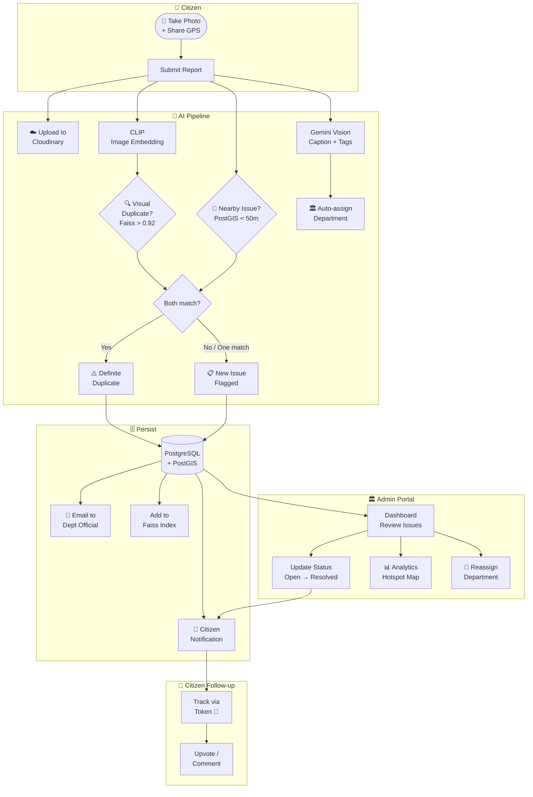

# AdvoLens 🔍

> **AI-Powered Civic Issue Reporting & Management Platform**  
> A community-driven approach to solving urban problems — one photo at a time.

[](https://fastapi.tiangolo.com)
[](https://nextjs.org)
[](https://postgis.net)
[](https://docker.com)

---

## 📋 Table of Contents

- [Overview](#-overview)
- [Supported Features](#-supported-features)
- [Team](#-team)
- [Problem Statement](#-problem-statement)
- [Key Features](#-key-features)
- [Tech Stack](#-tech-stack)
- [Quick Start](#-quick-start)
- [Project Structure](#-project-structure)
- [Documentation](#-documentation)
- [License](#-license)

---

## 🌟 Overview

AdvoLens is an AI-powered platform that enables citizens to report civic issues — garbage, damaged roads, broken streetlights, clogged drains — through simple image-based submissions from their mobile phones. The platform uses computer vision and machine learning to automatically **analyze**, **categorize**, **deduplicate**, and **route** issues to the correct municipal department, while giving citizens real-time tracking of their reports.



---

## ✅ Supported Features

### 📸 Issue Reporting
| Feature | Status | Notes |
|---------|--------|-------|
| Photo upload from camera or gallery | ✅ | `<input capture="environment">` for direct camera |
| Automatic GPS location capture | ✅ | Browser Geolocation API |
| Manual coordinate entry fallback | ✅ | For non-HTTPS / permission-denied cases |
| Optional description / title | ✅ | Auto-filled by Gemini if omitted |
| Image stored on Cloudinary CDN | ✅ | Permanent public URL returned |
| Anonymous submission (no account needed) | ✅ | Citizen identified only by tracking token |
| Tracking token issued on submission | ✅ | Saved to `localStorage` for follow-up |

### 🤖 AI / ML Pipeline
| Feature | Status | Notes |
|---------|--------|-------|
| Automatic image captioning | ✅ | Gemini 2.5 Flash Lite |
| Multi-label issue tagging | ✅ | Gemini generates structured JSON tags |
| 512-dim visual embedding | ✅ | CLIP `openai/clip-vit-base-patch32` |
| Visual duplicate detection | ✅ | Faiss cosine similarity, threshold 0.92 |
| Spatial duplicate detection | ✅ | PostGIS radius query within 50 m |
| Combined dual-signal deduplication | ✅ | Both visual + spatial must match for definite duplicate |
| Auto department assignment | ✅ | Tag-based routing to Municipality / PWD / KSEB / Water Authority |
| Issue priority scoring | ✅ | Formula: votes × 10 + status bonus − age penalty |

### 🗺️ Community & Maps
| Feature | Status | Notes |
|---------|--------|-------|
| Public issues feed | ✅ | All issues listed, newest first |
| Interactive Leaflet map | ✅ | Marker pins colour-coded by status |
| Issue detail page | ✅ | Full photo, caption, tags, location, comments |
| Visually similar issues panel | ✅ | Faiss-powered "similar reports" list |
| Community upvoting | ✅ | One vote per citizen token per issue |
| Community downvoting | ✅ | Lowers priority score |
| Public comments | ✅ | Anonymous threaded comments per issue |
| Comment deletion by author | ✅ | Token-verified delete |

### 🔔 Notifications
| Feature | Status | Notes |
|---------|--------|-------|
| In-app notification on issue created | ✅ | Includes assigned department |
| In-app notification on duplicate detected | ✅ | Links to the original issue |
| In-app notification on status change | ✅ | Triggered by admin status update |
| In-app notification on issue resolved | ✅ | Celebratory resolved message |
| Unread badge count | ✅ | `GET /notifications/count` |
| Mark single notification as read | ✅ | Per-notification PATCH endpoint |
| Mark all notifications as read | ✅ | Bulk PATCH endpoint |
| Email alert to department on new issue | ✅ | SMTP via Gmail (optional) |

### 🏛️ Admin Portal
| Feature | Status | Notes |
|---------|--------|-------|
| JWT-based admin login | ✅ | OAuth2 password flow |
| Role-based access control | ✅ | `super_admin` vs `official` roles |
| Department-scoped issue view | ✅ | Officials see only their dept issues |
| Issue status management | ✅ | Open → In Progress → Resolved → Closed |
| Issue reassignment to another dept | ✅ | Super Admin only |
| Issue deletion (spam removal) | ✅ | Super Admin only |
| Create new official / admin users | ✅ | Super Admin only, via API |
| Dashboard statistics cards | ✅ | Total, Open, In Progress, Resolved |
| Department breakdown stats | ✅ | Super Admin gets per-dept counts |

### 📊 Analytics
| Feature | Status | Notes |
|---------|--------|-------|
| Geographic hotspot detection | ✅ | DBSCAN clustering (configurable radius + min samples) |
| Hotspot map layer | ✅ | Cluster circles on Leaflet map |
| Issue heatmap data | ✅ | GeoJSON `[lon, lat, intensity]` for Mapbox/Leaflet |
| Analytics summary overview | ✅ | Top 10 hotspots + department breakdown |
| Priority issue rankings | ✅ | Sorted by priority score, up to top 50 |
| CSV export of all issues | ✅ | Filtered by status and/or department |

### 🔐 Security & Auth
| Feature | Status | Notes |
|---------|--------|-------|
| JWT access tokens (HS256) | ✅ | Configurable secret key |
| Bcrypt password hashing | ✅ | Via passlib |
| Role-based endpoint guards | ✅ | `get_current_user` FastAPI dependency |
| CORS allowlist | ✅ | Localhost + Vercel production origins |
| Citizen anonymity | ✅ | No PII stored, token is random URL-safe string |

### 🚀 Infrastructure & DevOps
| Feature | Status | Notes |
|---------|--------|-------|
| Docker containerisation | ✅ | `server/Dockerfile` with CPU PyTorch |
| Docker Hub image registry | ✅ | `sanjanamsanthoshsct/advolens-backend` |
| GitHub Actions CI/CD | ✅ | Manual trigger build-and-push workflow |
| Watchtower auto-deploy on VPS | ✅ | Polls Docker Hub every 5 minutes |
| Render.com config | ✅ | `render.yaml` included |
| Alembic database migrations | ✅ | 5 versioned migration scripts |
| Health check endpoint | ✅ | `GET /health` for Docker / load balancer |
| Database seeding scripts | ✅ | `seed_data.py` + `create_admin.py` |
| VPS management scripts | ✅ | `scripts/vps-commands.sh` |
| Progressive Web App (PWA) | ✅ | Installable, service worker, offline cache |

---

## 👥 Team

| Name | Roll No. | Role |
|------|----------|------|
| **Sanjana M Santhosh** | SCT22AM054 | Backend Development, Database, ML Pipeline Integration |
| **Aadinarayan M** | SCT22AM001 | Frontend Development, Dataset Creation, Optimization |
| **Gowri A** | SCT22AM032 | ML Services (Gemini), Admin Portal, Deployment |

**Guide:** Kutty Malu V K, Assistant Professor, CSE Department  
**Institution:** Sree Chitra Thirunal College of Engineering

---

## 🎯 Problem Statement

Urban areas face recurring civic issues that remain unresolved due to:
- ⏳ Delays in reporting and routing to the correct authority
- 🔄 Duplicate reports overwhelming the system
- 📍 Lack of geographic context for issue clustering
- 🏛️ Inefficient resource allocation across departments

---

## 🚀 Key Features

### For Citizens
- 📸 **Photo-based reporting** — snap a picture, GPS is auto-captured
- 🤖 **AI analysis** — automatic captioning, tagging, and department routing
- 🔍 **Duplicate detection** — visual + spatial deduplication prevents redundant reports
- 🔔 **Anonymous tracking** — get status updates without creating an account
- 🗺️ **Community feed** — see issues reported in your area on a map
- 👍 **Voting** — upvote issues to increase their priority
- 💬 **Comments** — discuss issues with the community

### For Municipal Admins
- 📊 **Dashboard** — view and manage all issues filtered by status, department
- 🏛️ **Department routing** — issues auto-assigned; Super Admins can reassign
- 🗺️ **Hotspot map** — DBSCAN clustering reveals problem areas
- 📈 **Analytics** — heatmaps, priority scores, CSV export
- ✅ **Status management** — update issues (Open → In Progress → Resolved)
- 📧 **Email notifications** — officials are notified of new assignments

---

## 🛠️ Tech Stack

### Frontend
| Technology | Purpose |
|-----------|---------|
| Next.js 16 (App Router) | React framework, SSR, PWA |
| Tailwind CSS v4 | Utility-first styling |
| Material-UI v7 | Component library |
| Leaflet.js | Interactive maps |
| Chart.js | Analytics charts |
| Axios | HTTP client |

### Backend
| Technology | Purpose |
|-----------|---------|
| FastAPI 0.109 | REST API framework |
| SQLAlchemy 2.0 | ORM |
| PostgreSQL + PostGIS | Relational DB with geospatial support |
| Alembic | Database migrations |
| JWT / python-jose | Authentication |
| Passlib + bcrypt | Password hashing |
| Cloudinary | Image storage |

### AI / ML
| Model/Library | Purpose |
|--------------|---------|
| CLIP (`openai/clip-vit-base-patch32`) | 512-dim image embeddings |
| Gemini 2.5 Flash Lite | Image captioning + multi-label tagging |
| Faiss (IndexFlatIP) | Vector similarity search (cosine) |
| scikit-learn DBSCAN | Geographic hotspot clustering |

### Infrastructure
| Tool | Purpose |
|------|---------|
| Docker | Containerization |
| Docker Hub | Image registry |
| Render.com | Cloud hosting (backend) |
| Vercel | Frontend hosting |
| Watchtower | Auto-deploy on VPS |

---

## ⚡ Quick Start

### Prerequisites
- Python 3.11+
- Node.js 18+
- PostgreSQL with PostGIS extension
- Docker (optional but recommended)

### Backend Setup

```bash
# 1. Clone the repository
git clone https://github.com/Sanjana-Santhosh/AdvoLens.git
cd AdvoLens

# 2. Install dependencies
cd server
pip install -r requirements.txt

# 3. Configure environment
cp .env.example .env
# Edit .env with your credentials (see docs/deployment.md)

# 4. Run database migrations
alembic upgrade head

# 5. Start the API server
uvicorn app.main:app --host 0.0.0.0 --port 8000 --reload
```

API will be available at `http://localhost:8000`  
Interactive docs at `http://localhost:8000/docs`

### Frontend Setup

```bash
cd client
npm install
npm run dev
```

Frontend will be available at `http://localhost:3000`

### Docker (Recommended)

```bash
cd server
docker build -t advolens-backend .
docker run -p 8000:8000 --env-file .env advolens-backend
```

---

## 📁 Project Structure

```
AdvoLens/
├── client/                      # Next.js frontend (PWA)
│   ├── app/
│   │   ├── page.tsx             # Home / landing page
│   │   ├── report/              # Issue reporting form
│   │   ├── feed/                # Community issues feed
│   │   ├── issues/[id]/         # Issue detail view
│   │   ├── notifications/       # Citizen notification centre
│   │   ├── admin/
│   │   │   ├── dashboard/       # Admin issue management
│   │   │   ├── analytics/       # Hotspot map & charts
│   │   │   └── login/           # Admin authentication
│   │   └── api/                 # Next.js API route proxies
│   ├── components/
│   │   └── IssueMap.tsx         # Leaflet map component
│   └── lib/
│       └── api.ts               # Axios API client helpers
│
├── server/                      # FastAPI backend
│   ├── app/
│   │   ├── main.py              # App factory, CORS, router mounting
│   │   ├── api/
│   │   │   ├── issues.py        # Issue CRUD + AI pipeline
│   │   │   ├── auth.py          # Login, register, JWT
│   │   │   ├── admin.py         # Admin management routes
│   │   │   ├── notifications.py # Citizen notification endpoints
│   │   │   ├── analytics.py     # Hotspots, heatmap, CSV export
│   │   │   └── engagement.py    # Votes & comments
│   │   ├── core/
│   │   │   ├── config.py        # Settings / env vars
│   │   │   ├── database.py      # SQLAlchemy engine & session
│   │   │   ├── auth.py          # JWT creation & password utils
│   │   │   └── security.py      # get_current_user dependency
│   │   ├── models/              # SQLAlchemy ORM models
│   │   ├── schemas/             # Pydantic request/response schemas
│   │   ├── crud/                # Database access layer
│   │   ├── ml/
│   │   │   ├── clip_service.py  # CLIP embedding service
│   │   │   ├── gemini_service.py# Gemini image analysis
│   │   │   ├── faiss_manager.py # Vector index management
│   │   │   └── geo_clustering.py# DBSCAN hotspot detection
│   │   └── services/
│   │       ├── cloudinary_service.py # Image upload
│   │       ├── email_service.py      # SMTP notifications
│   │       ├── routing_service.py    # Department auto-assign
│   │       ├── geo_service.py        # Spatial proximity search
│   │       └── notification.py       # In-app notification helpers
│   ├── alembic/                 # Database migration scripts
│   ├── Dockerfile
│   ├── requirements.txt
│   └── .env.example
│
├── scripts/
│   ├── build-and-push.sh        # Docker build & push to Hub
│   ├── build-local.sh           # Local Docker build
│   └── vps-commands.sh          # VPS management helpers
│
├── datasets/                    # Training data (gitignored)
├── ml-services/                 # Standalone ML service stubs
├── render.yaml                  # Render.com deployment config
└── docs/                        # 📚 Full documentation
    ├── architecture.md
    ├── api.md
    ├── ml-models.md
    ├── deployment.md
    └── frontend.md
```

---

## 📚 Documentation

| Document | Description |
|----------|-------------|
| [Architecture](./docs/architecture.md) | System design, component diagrams, data flow, database schema |
| [API Reference](./docs/api.md) | All REST endpoints with request/response examples |
| [ML Models](./docs/ml-models.md) | CLIP, Gemini, FAISS, DBSCAN — how they work and integrate |
| [Deployment Guide](./docs/deployment.md) | Local, Docker, Render.com, VPS, environment variables |
| [Frontend Guide](./docs/frontend.md) | Next.js pages, PWA setup, API client layer |

---

## 🔗 Links

- **Live Demo:** [https://advolens.vercel.app](https://advolens.vercel.app) *(coming soon)*
- **API Docs (interactive):** `http://<backend-url>/docs`
- **Docker Image:** `sanjanamsanthoshsct/advolens-backend`

---

## 📝 License

This is an academic project developed for educational purposes at Sree Chitra Thirunal College of Engineering.

---

## 📞 Contact

For questions or collaboration, open an issue on GitHub or reach out to the team.
