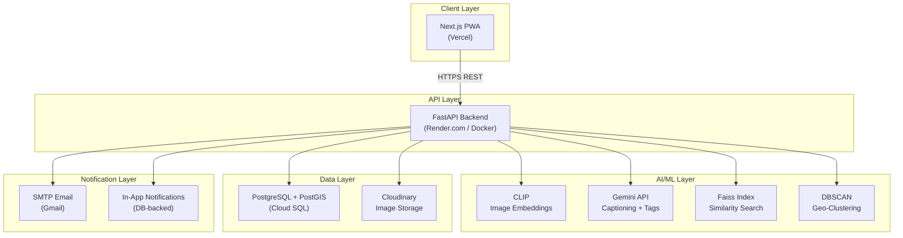
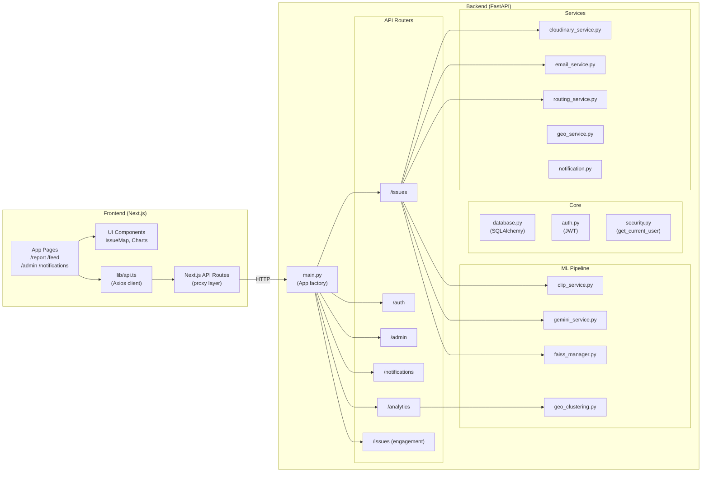
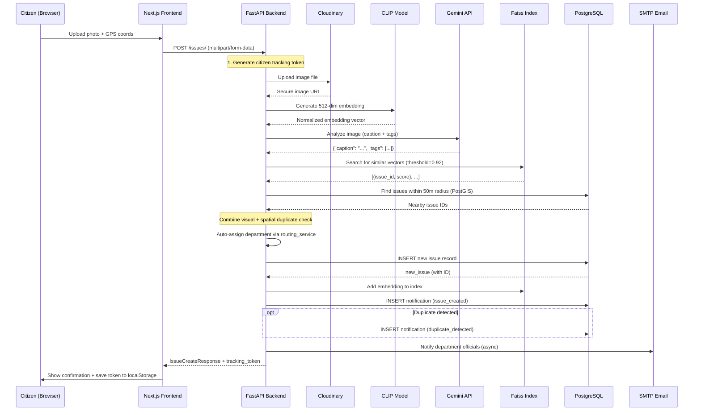
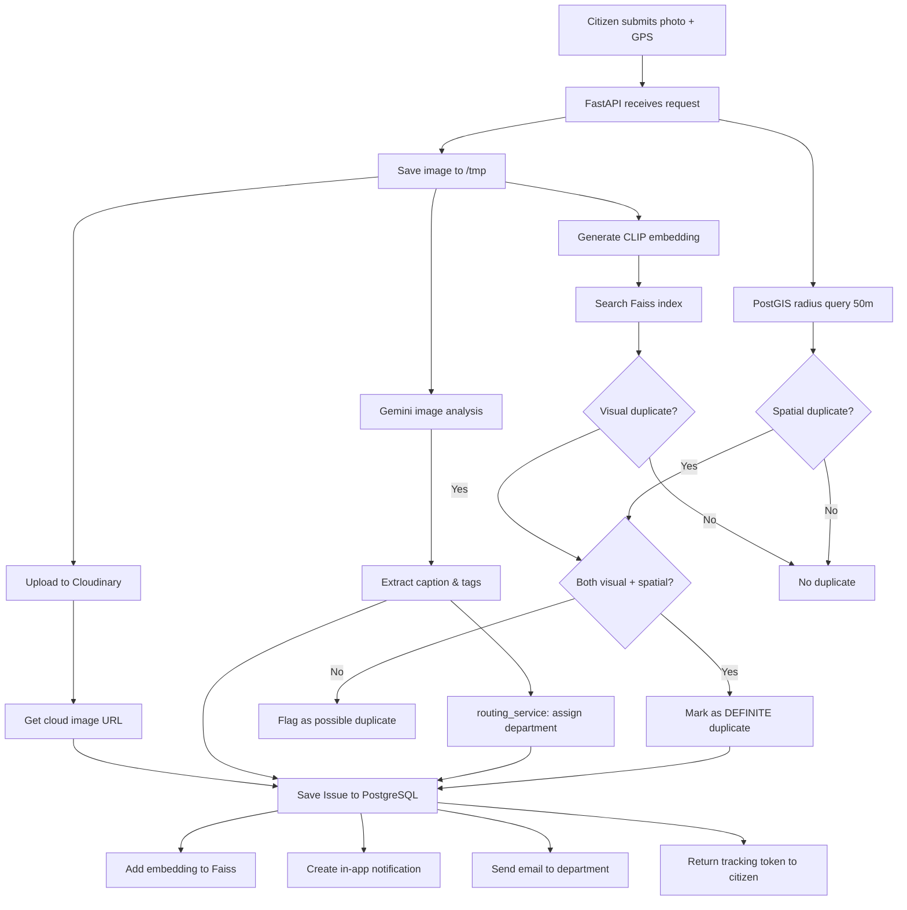
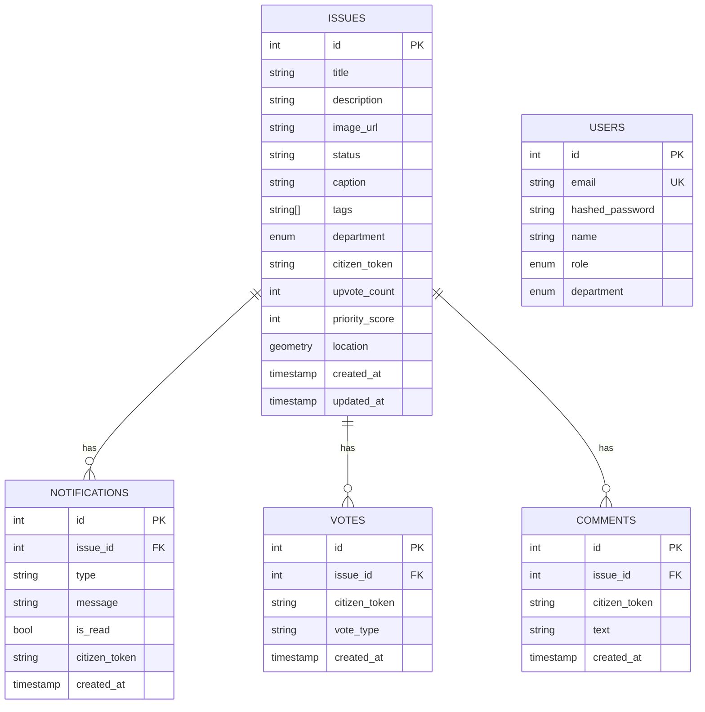
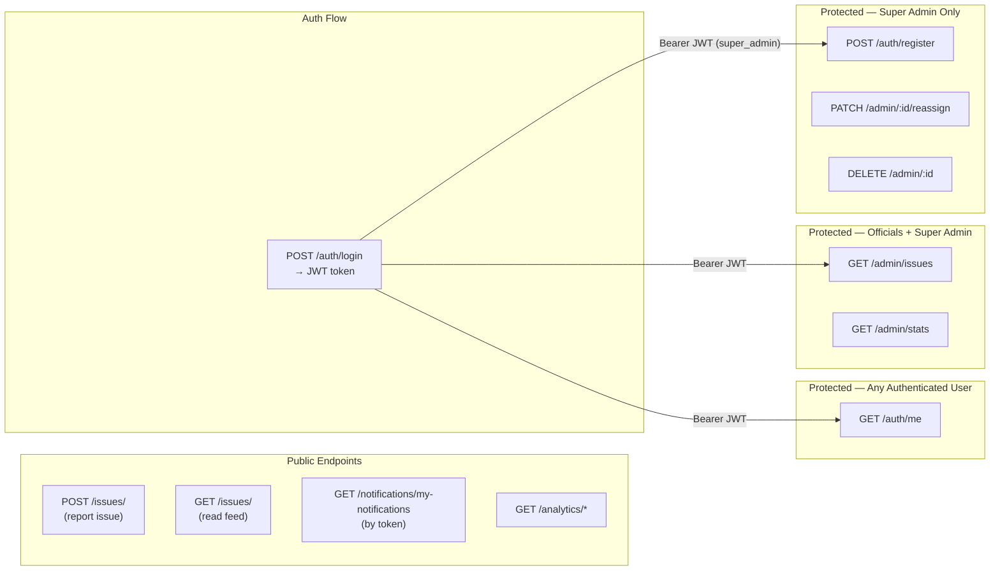
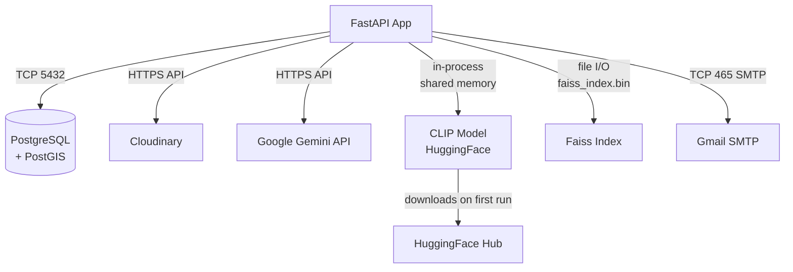
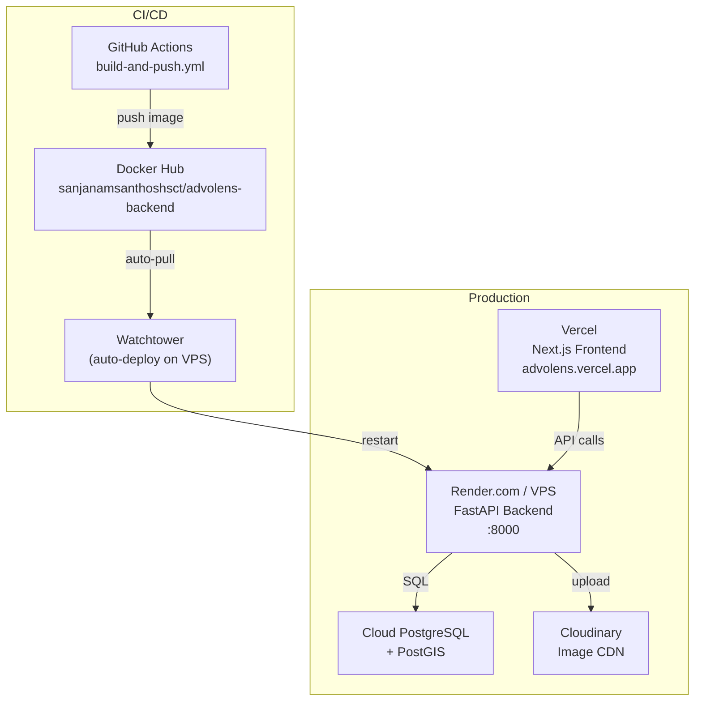

# AdvoLens — System Architecture

> **Navigation:** [Home](../README.md) | Architecture | [API Reference](./api.md) | [ML Models](./ml-models.md) | [Deployment](./deployment.md) | [Frontend](./frontend.md)

---

## Table of Contents

- [High-Level Overview](#high-level-overview)
- [Component Architecture](#component-architecture)
- [Request Lifecycle — Issue Submission](#request-lifecycle--issue-submission)
- [Data Flow Diagram](#data-flow-diagram)
- [Application Layers](#application-layers)
- [Database Schema](#database-schema)
- [Authentication & Authorization](#authentication--authorization)
- [Service Dependencies](#service-dependencies)
- [Deployment Architecture](#deployment-architecture)

---

## High-Level Overview

AdvoLens is built as a three-tier web application with an integrated AI/ML pipeline:



---

## Component Architecture



---

## Request Lifecycle — Issue Submission

The most complex flow in the system is when a citizen submits a new issue. Here is the full end-to-end pipeline:



---

## Data Flow Diagram



---

## Application Layers

The backend follows a clean layered architecture:

```
┌─────────────────────────────────────────────────────────┐
│                    API Layer (routers)                   │
│   issues.py | auth.py | admin.py | notifications.py     │
│   analytics.py | engagement.py                          │
├─────────────────────────────────────────────────────────┤
│                  Business Logic Layer                    │
│   ML Pipeline: clip_service → faiss_manager →           │
│               gemini_service → routing_service          │
│   Services: cloudinary | email | geo | notification      │
├─────────────────────────────────────────────────────────┤
│                    CRUD Layer                            │
│   crud/issue.py — database access functions             │
├─────────────────────────────────────────────────────────┤
│                    Data Layer                            │
│   SQLAlchemy models (Issue, User, Notification,         │
│   Vote, Comment) backed by PostgreSQL + PostGIS         │
├─────────────────────────────────────────────────────────┤
│                  Infrastructure Layer                    │
│   PostgreSQL | Cloudinary | SMTP | Faiss index file     │
└─────────────────────────────────────────────────────────┘
```

### Layer Responsibilities

| Layer | Files | Responsibility |
|-------|-------|----------------|
| **API** | `app/api/*.py` | Route handlers, request validation, HTTP responses |
| **Core** | `app/core/*.py` | Config, DB session factory, JWT auth, security deps |
| **ML** | `app/ml/*.py` | CLIP, Gemini, Faiss, DBSCAN — stateless singletons |
| **Services** | `app/services/*.py` | External integrations (Cloudinary, email, geo) |
| **CRUD** | `app/crud/*.py` | Database read/write operations via SQLAlchemy |
| **Models** | `app/models/*.py` | SQLAlchemy ORM table definitions |
| **Schemas** | `app/schemas/*.py` | Pydantic models for request/response validation |

---

## Database Schema



### Key Design Decisions

| Decision | Rationale |
|----------|-----------|
| **PostGIS geometry column** | Enables native spatial queries (radius search, distance) in PostgreSQL |
| **Anonymous citizen token** | Citizens report without registration; token stored in `localStorage` |
| **ARRAY(String) for tags** | PostgreSQL native array for multi-label tag storage |
| **Enum for department** | Enforces valid department values at DB level |
| **priority_score column** | Pre-calculated score (votes + age + status) for fast sorting |

---

## Authentication & Authorization



**User Roles:**

| Role | Value | Capabilities |
|------|-------|-------------|
| `super_admin` | Super Admin | All operations: view all issues, reassign, delete, create users |
| `official` | Department Official | View & manage only their department's issues |

---

## Service Dependencies



### External Services Summary

| Service | Protocol | Config Variable | Required |
|---------|----------|----------------|---------|
| PostgreSQL | TCP 5432 | `DATABASE_URL` | ✅ Yes |
| Cloudinary | HTTPS | `CLOUDINARY_*` | ✅ Yes |
| Google Gemini | HTTPS | `GEMINI_API_KEY` | ✅ Yes |
| Gmail SMTP | SMTP/SSL | `SMTP_EMAIL`, `SMTP_PASSWORD` | ⚠️ Optional |

---

## Deployment Architecture

See [Deployment Guide](./deployment.md) for full setup instructions.


