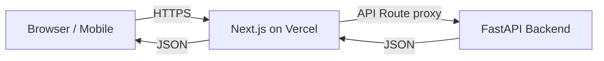

# AdvoLens — Frontend Guide

> **Navigation:** [Home](../README.md) | [Architecture](./architecture.md) | [API Reference](./api.md) | [ML Models](./ml-models.md) | [Deployment](./deployment.md) | Frontend

---

## Table of Contents

- [Overview](#overview)
- [Tech Stack](#tech-stack)
- [Project Structure](#project-structure)
- [Pages & Routes](#pages--routes)
- [API Routes (Next.js Proxy)](#api-routes-nextjs-proxy)
- [Components](#components)
- [API Client (lib/api.ts)](#api-client-libapits)
- [PWA Configuration](#pwa-configuration)
- [Running Locally](#running-locally)
- [Deployment to Vercel](#deployment-to-vercel)
- [Environment Variables](#environment-variables)

---

## Overview

The AdvoLens frontend is a **Progressive Web App (PWA)** built with **Next.js 16** using the App Router. It provides:

- A **citizen-facing** mobile-first interface for reporting and tracking issues
- An **admin portal** for municipal officials to manage and analyze reports

The frontend communicates with the FastAPI backend through **Next.js API route proxies** (not directly), which keeps the backend URL hidden and avoids CORS issues.



---

## Tech Stack

| Technology | Version | Purpose |
|-----------|---------|---------|
| Next.js | 16.1.1 | React framework with App Router |
| React | 19.2.3 | UI library |
| TypeScript | 5.x | Type safety |
| Tailwind CSS | v4 | Utility-first styling |
| Material UI | v7 | Component library (admin portal) |
| Leaflet.js | 1.9.4 | Interactive maps |
| Chart.js | 4.5.1 | Analytics charts |
| Axios | 1.13.2 | HTTP client |
| react-hook-form | 7.x | Form management |
| next-pwa | 5.6.0 | PWA support (service worker) |
| lucide-react | 0.562.0 | Icon library |

---

## Project Structure

```
client/
├── app/                          # Next.js App Router
│   ├── layout.tsx                # Root layout (PWA meta tags)
│   ├── page.tsx                  # Home / landing page
│   ├── globals.css               # Global styles + Tailwind
│   ├── favicon.ico
│   │
│   ├── report/
│   │   └── page.tsx              # Issue reporting form
│   │
│   ├── feed/
│   │   └── page.tsx              # Community issues feed + map
│   │
│   ├── issues/
│   │   └── [id]/
│   │       └── page.tsx          # Issue detail view
│   │
│   ├── notifications/
│   │   └── page.tsx              # Citizen notification centre
│   │
│   ├── admin/
│   │   ├── page.tsx              # Admin redirect
│   │   ├── login/
│   │   │   └── page.tsx          # Admin login
│   │   ├── dashboard/
│   │   │   └── page.tsx          # Issue management dashboard
│   │   └── analytics/
│   │       └── page.tsx          # Hotspot map + charts
│   │
│   └── api/                      # Next.js API route proxies
│       ├── issues/
│       │   ├── route.ts          # GET /api/issues, POST /api/issues
│       │   └── [id]/
│       │       ├── route.ts      # GET /api/issues/:id
│       │       ├── similar/
│       │       │   └── route.ts  # GET /api/issues/:id/similar
│       │       └── status/
│       │           └── route.ts  # PATCH /api/issues/:id/status
│       ├── auth/
│       │   ├── login/
│       │   │   └── route.ts      # POST /api/auth/login
│       │   └── me/
│       │       └── route.ts      # GET /api/auth/me
│       ├── admin/
│       │   ├── issues/
│       │   │   ├── route.ts      # GET /api/admin/issues
│       │   │   └── [id]/
│       │   │       └── route.ts  # PATCH/DELETE /api/admin/issues/:id
│       │   └── stats/
│       │       └── route.ts      # GET /api/admin/stats
│       └── notifications/
│           ├── route.ts          # GET /api/notifications
│           ├── count/
│           │   └── route.ts      # GET /api/notifications/count
│           └── [id]/
│               └── read/
│                   └── route.ts  # PATCH /api/notifications/:id/read
│
├── components/
│   └── IssueMap.tsx              # Leaflet interactive map
│
├── lib/
│   └── api.ts                    # Axios client + helper functions
│
├── public/
│   ├── manifest.json             # PWA manifest
│   ├── icon-192x192.svg          # PWA icon (small)
│   └── icon-512x512.svg          # PWA icon (large)
│
├── next.config.ts                # Next.js + PWA config
├── tsconfig.json
└── package.json
```

---

## Pages & Routes

### Citizen Pages

#### `/` — Home Page
The landing page introducing AdvoLens with quick action buttons.

| Feature | Description |
|---------|-------------|
| Report an Issue | Link to `/report` |
| View Community Reports | Link to `/feed` |
| My Updates | Link to `/notifications` |
| How it works | Feature overview cards |

---

#### `/report` — Report Issue
The main citizen form for submitting a new issue.

```mermaid
flowchart TD
    A[Open /report] --> B[Take/upload photo]
    B --> C{Geolocation available?}
    C -- Yes --> D[Click "Get Current Location"]
    D --> E[Browser requests GPS]
    C -- No / Denied --> F[Enter coordinates manually]
    F --> G[Latitude + Longitude input]
    E --> H{Location captured?}
    G --> H
    H -- Yes --> I[Optional: Add description]
    I --> J[Click "Submit Report"]
    J --> K[POST /api/issues]
    K --> L[AI pipeline runs on backend]
    L --> M[Save tracking_token to localStorage]
    M --> N[Redirect to /notifications]
```

**Geolocation handling:**
- Automatically requests GPS via browser API
- Falls back to manual coordinate entry if:
  - Geolocation not supported
  - Permission denied
  - Non-HTTPS context
  - Timeout

---

#### `/feed` — Community Issues Feed
Shows all reported issues from the community.

| Feature | Description |
|---------|-------------|
| List view | All issues with status badges, tags, upvote counts |
| Map view | Interactive Leaflet map showing issue locations |
| Issue cards | Click to open detail view |

---

#### `/issues/[id]` — Issue Detail
Full detail view for a single issue.

| Feature | Description |
|---------|-------------|
| Image | Full issue photo |
| AI caption + tags | Gemini-generated description |
| Status badge | Current status (Open / In Progress / Resolved) |
| Department | Auto-assigned department |
| Map | Issue location on map |
| Similar issues | Visually similar issues via Faiss |
| Vote | Upvote/downvote buttons |
| Comments | Comment thread |

---

#### `/notifications` — My Updates
Shows status updates for issues submitted by this citizen.

Notifications are fetched using the `tracking_token` stored in `localStorage`.

| Notification Type | Description |
|------------------|-------------|
| `issue_created` | Confirmation your report was received |
| `duplicate_detected` | A similar issue already exists |
| `status_updated` | Admin changed the status |
| `issue_resolved` | Your issue has been resolved |

---

### Admin Pages

#### `/admin/login` — Admin Login
JWT-based login form for municipal officials.

- Submits `username` + `password` as OAuth2 form data
- Stores access token in `localStorage` as `admin_token`
- Redirects to `/admin/dashboard` on success

---

#### `/admin/dashboard` — Issue Management Dashboard
The main admin workspace.

| Feature | Description |
|---------|-------------|
| Stats cards | Total, Open, In Progress, Resolved counts |
| Issue table | All issues with filters |
| Status filter | Filter by Open / In Progress / Resolved |
| Department filter | Filter by department (super_admin only) |
| Status update | Change issue status with dropdown |
| Reassign | Move issue to different department (super_admin) |
| Delete | Remove spam issues (super_admin) |

---

#### `/admin/analytics` — Hotspot Analytics
Geographic and statistical analysis of civic issues.

| Feature | Description |
|---------|-------------|
| Hotspot map | Leaflet map showing DBSCAN clusters |
| Heatmap layer | Issue density visualization |
| Department breakdown | Chart.js bar/pie charts |
| Priority issues | Top issues by priority score |
| CSV export | Download all issues as CSV |

---

## API Routes (Next.js Proxy)

Next.js API routes act as a **reverse proxy** between the frontend and the FastAPI backend. This pattern:
- Hides the backend URL from the browser
- Avoids CORS issues
- Allows adding auth headers server-side

### Example Proxy Route

```typescript
// client/app/api/issues/route.ts
import { NextRequest, NextResponse } from 'next/server';

const BACKEND_URL = process.env.NEXT_PUBLIC_BACKEND_URL;

export async function GET(request: NextRequest) {
  const response = await fetch(`${BACKEND_URL}/issues/`, {
    headers: { 'Content-Type': 'application/json' },
  });
  const data = await response.json();
  return NextResponse.json(data);
}

export async function POST(request: NextRequest) {
  const formData = await request.formData();
  const response = await fetch(`${BACKEND_URL}/issues/`, {
    method: 'POST',
    body: formData,
  });
  const data = await response.json();
  return NextResponse.json(data, { status: response.status });
}
```

### Proxy Route Mapping

| Next.js Route | Backend Route | Methods |
|---------------|---------------|---------|
| `/api/issues` | `/issues/` | GET, POST |
| `/api/issues/[id]` | `/issues/{id}` | GET |
| `/api/issues/[id]/similar` | `/issues/{id}/duplicates` | GET |
| `/api/issues/[id]/status` | `/issues/{id}/status` | PATCH |
| `/api/auth/login` | `/auth/login` | POST |
| `/api/auth/me` | `/auth/me` | GET |
| `/api/admin/issues` | `/admin/issues` | GET |
| `/api/admin/issues/[id]` | `/admin/{id}` | PATCH, DELETE |
| `/api/admin/stats` | `/admin/stats` | GET |
| `/api/notifications` | `/notifications/my-notifications` | GET |
| `/api/notifications/count` | `/notifications/count` | GET |
| `/api/notifications/[id]/read` | `/notifications/{id}/read` | PATCH |

---

## Components

### `IssueMap.tsx`

An interactive Leaflet.js map component used in both the feed page and admin analytics.

**Props:**

| Prop | Type | Description |
|------|------|-------------|
| `issues` | `Issue[]` | Array of issues to plot |
| `hotspots` | `Hotspot[]` | Optional cluster markers |
| `center` | `[lat, lon]` | Initial map center |
| `zoom` | `number` | Initial zoom level |

**Features:**
- Marker pins for each issue (color-coded by status)
- Click marker to see issue summary popup
- Cluster circles for DBSCAN hotspots
- Heatmap layer toggle (admin analytics)

> **Note:** Leaflet requires the `'use client'` directive as it's a browser-only library.

---

## API Client (lib/api.ts)

The `lib/api.ts` file provides typed helper functions for all API calls using Axios:

```typescript
import axios from 'axios';

const api = axios.create({
  baseURL: process.env.NEXT_PUBLIC_API_URL || '',
});

// Issue helpers
export const createIssue = (formData: FormData) =>
  api.post('/api/issues', formData, {
    headers: { 'Content-Type': 'multipart/form-data' },
  }).then(r => r.data);

export const getIssues = () =>
  api.get('/api/issues').then(r => r.data);

export const getIssue = (id: number) =>
  api.get(`/api/issues/${id}`).then(r => r.data);

export const searchSimilarIssues = (id: number, limit = 5) =>
  api.get(`/api/issues/${id}/similar?limit=${limit}`).then(r => r.data);

export const updateIssueStatus = (id: number, status: string) =>
  api.patch(`/api/issues/${id}/status`, { status }).then(r => r.data);

// Image URL helper (Cloudinary or legacy local)
export const getImageUrl = (imagePath: string) => {
  if (imagePath.startsWith('http://') || imagePath.startsWith('https://')) {
    return imagePath; // Already a full Cloudinary URL
  }
  return `${process.env.NEXT_PUBLIC_BACKEND_URL}/${imagePath}`;
};
```

**Usage in pages:**

```typescript
// In a React Server Component or Client Component
import { getIssues } from '@/lib/api';

const issues = await getIssues();
```

---

## PWA Configuration

AdvoLens is configured as a **Progressive Web App** using `next-pwa`:

### `public/manifest.json`

```json
{
  "name": "AdvoLens",
  "short_name": "AdvoLens",
  "description": "AI-Powered Civic Issue Reporting",
  "start_url": "/",
  "display": "standalone",
  "background_color": "#ffffff",
  "theme_color": "#2563eb",
  "icons": [
    { "src": "/icon-192x192.svg", "sizes": "192x192", "type": "image/svg+xml" },
    { "src": "/icon-512x512.svg", "sizes": "512x512", "type": "image/svg+xml" }
  ]
}
```

### PWA Features

| Feature | Description |
|---------|-------------|
| **Install prompt** | Users can add AdvoLens to their home screen |
| **Offline support** | Service worker caches static assets |
| **Camera access** | `<input capture="environment">` opens device camera directly |
| **GPS access** | `navigator.geolocation` for auto location capture |

### `next.config.ts`

```typescript
import withPWA from 'next-pwa';

const nextConfig = withPWA({
  dest: 'public',
  register: true,
  skipWaiting: true,
  disable: process.env.NODE_ENV === 'development',
})({
  // Next.js config
});

export default nextConfig;
```

---

## Running Locally

```bash
cd client

# Install dependencies
npm install

# Start development server
npm run dev
# → http://localhost:3000

# Build for production
npm run build

# Start production server
npm start

# Lint
npm run lint
```

---

## Deployment to Vercel

See [Deployment Guide](./deployment.md#frontend-deployment-vercel) for full instructions.

**Quick steps:**
1. Import GitHub repo on [vercel.com](https://vercel.com)
2. Set root directory to `client`
3. Add `NEXT_PUBLIC_BACKEND_URL` environment variable
4. Deploy — auto-redeploys on every push

---

## Environment Variables

| Variable | Required | Description |
|----------|----------|-------------|
| `NEXT_PUBLIC_BACKEND_URL` | ✅ | Full URL of FastAPI backend (e.g., `https://api.advolens.com`) |
| `NEXT_PUBLIC_API_URL` | ❌ | Override for API base URL (defaults to same origin) |
