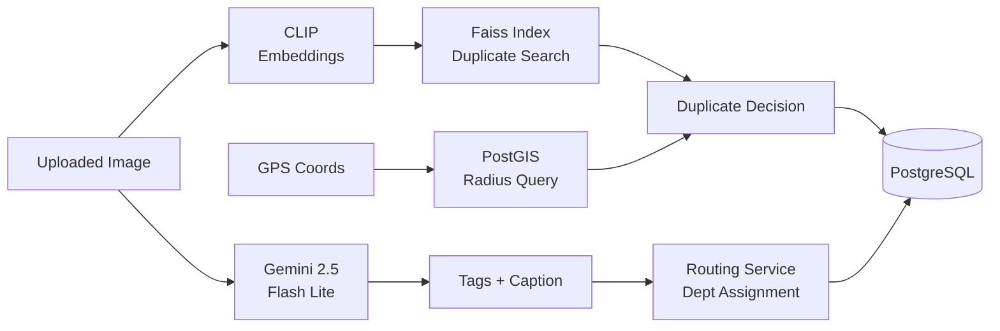
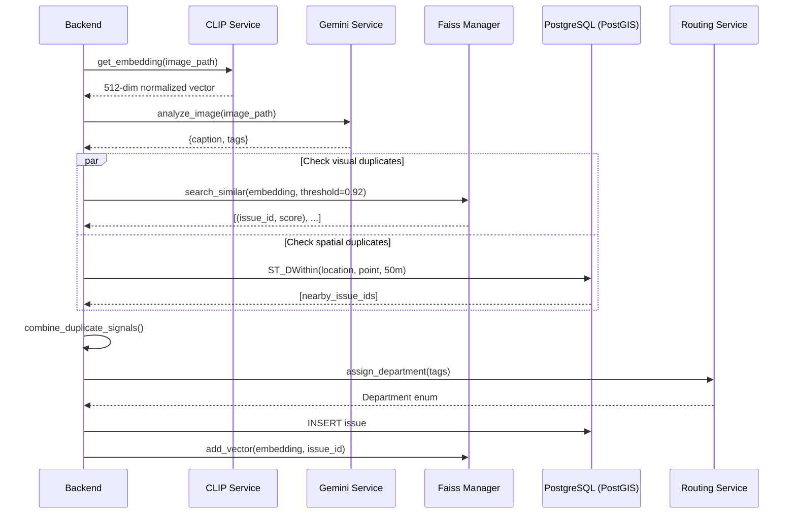
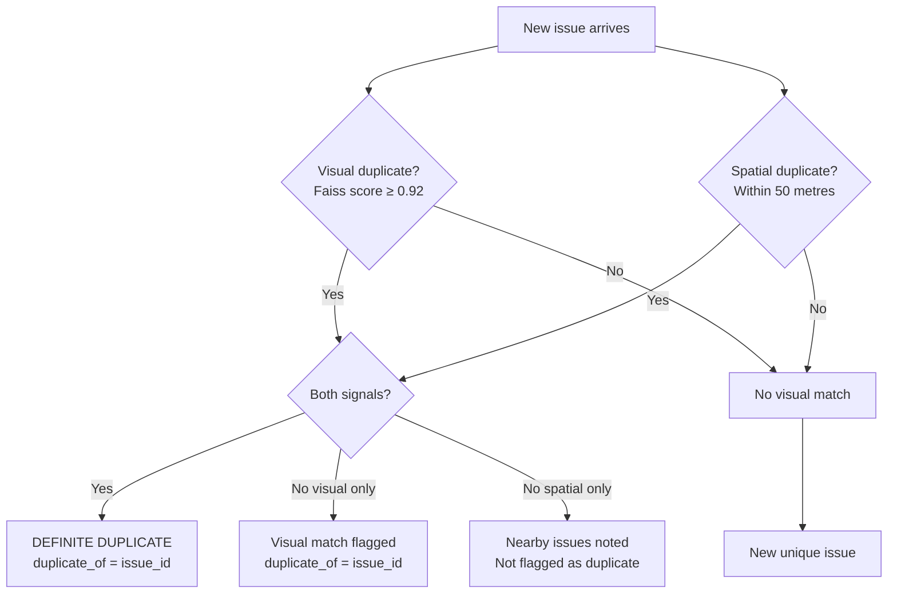
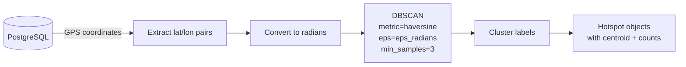
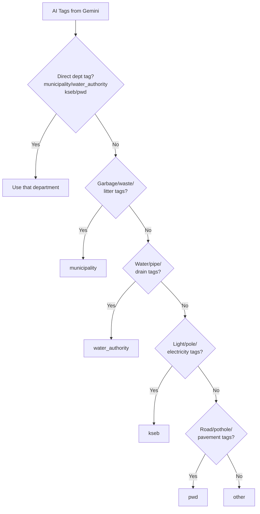
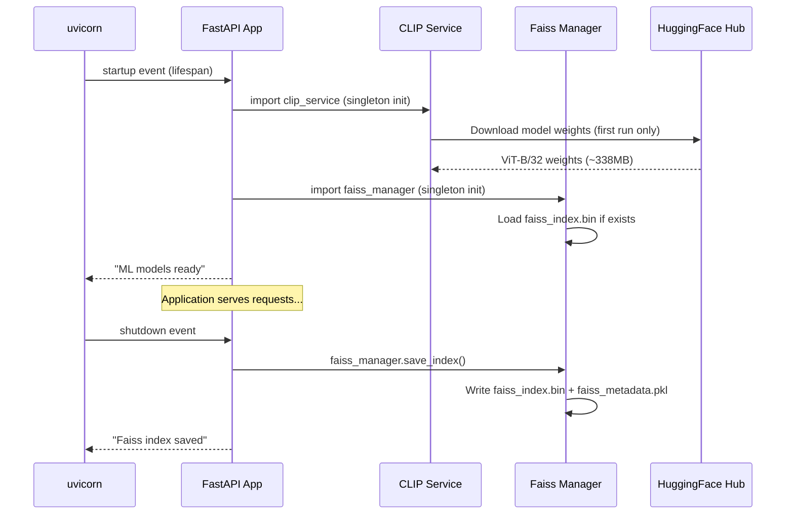

# AdvoLens — ML Models & AI Pipeline

> **Navigation:** [Home](../README.md) | [Architecture](./architecture.md) | [API Reference](./api.md) | ML Models | [Deployment](./deployment.md) | [Frontend](./frontend.md)

---

## Table of Contents

- [Overview](#overview)
- [AI Pipeline Flow](#ai-pipeline-flow)
- [CLIP — Image Embeddings](#clip--image-embeddings)
- [Gemini — Image Analysis](#gemini--image-analysis)
- [Faiss — Vector Similarity Search](#faiss--vector-similarity-search)
- [Duplicate Detection Logic](#duplicate-detection-logic)
- [DBSCAN — Geographic Hotspot Clustering](#dbscan--geographic-hotspot-clustering)
- [Department Routing](#department-routing)
- [Priority Score Algorithm](#priority-score-algorithm)
- [Model Startup & Lifecycle](#model-startup--lifecycle)
- [Performance Notes](#performance-notes)

---

## Overview

AdvoLens uses a multi-model AI pipeline to process each submitted civic issue automatically. No human intervention is needed to classify, deduplicate, or route issues.



---

## AI Pipeline Flow



---

## CLIP — Image Embeddings

**Model:** `openai/clip-vit-base-patch32`  
**Library:** HuggingFace `transformers`  
**File:** `server/app/ml/clip_service.py`

### What it does

CLIP (Contrastive Language-Image Pretraining) encodes images into a 512-dimensional vector that captures semantic visual content. Images showing similar civic issues (e.g., two photos of garbage dumps) will have vectors that are close together in the embedding space.


### Technical Details

| Property | Value |
|----------|-------|
| Model | `openai/clip-vit-base-patch32` |
| Embedding dimension | 512 |
| Normalization | L2 (unit norm) |
| Device | CPU (GPU if CUDA available) |
| Load strategy | Singleton — loaded once at app startup |

### Code Flow

```python
# 1. Load image using PIL
image = Image.open(image_path)

# 2. Pre-process with CLIPProcessor
inputs = processor(images=image, return_tensors="pt", padding=True)

# 3. Forward pass through ViT vision encoder
with torch.no_grad():
    outputs = model.get_image_features(**inputs)

# 4. Normalize to unit length (enables cosine similarity via dot product)
embedding = outputs.cpu().numpy().flatten()
return embedding / np.linalg.norm(embedding)
```

### Why CLIP?

- **Zero-shot**: Works on any image type without fine-tuning on civic issues
- **Semantic**: Similar-looking issues cluster together naturally
- **Fast**: ViT-B/32 is the smallest CLIP variant, suitable for CPU inference
- **Well-supported**: Widely used, stable HuggingFace integration

---

## Gemini — Image Analysis

**Model:** `gemini-2.5-flash-lite`  
**Library:** `google-genai` SDK  
**File:** `server/app/ml/gemini_service.py`

### What it does

Gemini Vision analyzes civic issue images and returns:
1. A **caption** — a concise one-sentence human-readable description
2. **Tags** — structured multi-label classification including the responsible department

### Prompt Engineering

The model is given a carefully crafted prompt that instructs it to:

1. Identify the type of civic issue
2. Include the **department tag** (one of: `municipality`, `water_authority`, `kseb`, `pwd`, `other`)
3. Include **issue-specific tags** from a predefined vocabulary
4. Return a strict JSON object (not markdown, not prose)

```
{"caption": "...", "tags": ["department_tag", "issue_tag1", "issue_tag2"]}
```

### Tag Taxonomy

```mermaid
graph TD
    ROOT[Issue Tags]
    ROOT --> MUN[municipality]
    ROOT --> WA[water_authority]
    ROOT --> KSEB[kseb]
    ROOT --> PWD[pwd]
    ROOT --> OTHER[other]

    MUN --> M1[garbage, trash, dumping]
    MUN --> M2[waste, litter, plastic_waste]
    MUN --> M3[overflowing_bin, street_litter]

    WA --> W1[water, leak, pipe]
    WA --> W2[sewage, drain, drainage]
    WA --> W3[flooding, waterlogging]

    KSEB --> K1[streetlight, pole, wire]
    KSEB --> K2[electricity, power, transformer]
    KSEB --> K3[broken_streetlight, cable]

    PWD --> P1[road, pothole, tar]
    PWD --> P2[pavement, bridge, highway]
    PWD --> P3[footpath, road_damage]

    OTHER --> O1[graffiti, abandoned_vehicle]
    OTHER --> O2[stray_animal, encroachment, noise]
```



### Example Responses

**Garbage issue:**
```json
{
  "caption": "Pile of plastic bottles and food wrappers scattered on street corner",
  "tags": ["municipality", "garbage", "street_litter", "plastic_waste"]
}
```

**Road issue:**
```json
{
  "caption": "Large pothole on main road causing traffic hazard",
  "tags": ["pwd", "pothole", "road_damage", "road"]
}
```

**Streetlight issue:**
```json
{
  "caption": "Broken streetlight pole leaning dangerously over sidewalk",
  "tags": ["kseb", "streetlight", "pole", "broken_streetlight"]
}
```

### Error Handling

| Error | Response |
|-------|----------|
| JSON parse failure | `{"caption": "Unable to parse image analysis", "tags": ["other"]}` |
| API error | `{"caption": "Unable to analyze image", "tags": ["other"]}` |

---

## Faiss — Vector Similarity Search

**Library:** `faiss-cpu` v1.8.0  
**Index type:** `IndexFlatIP` (Inner Product = cosine similarity on unit vectors)  
**File:** `server/app/ml/faiss_manager.py`

### What it does

Faiss maintains an in-memory index of all CLIP embeddings ever submitted. When a new issue arrives, its embedding is searched against this index to find visually similar past issues.


### Index Architecture

```
Index Memory Layout:
┌────────────────────────────────────┐
│  IndexFlatIP (Faiss)               │
│  ┌──────────────────────────────┐  │
│  │ Row 0: embedding of issue 1  │  │
│  │ Row 1: embedding of issue 4  │  │
│  │ Row 2: embedding of issue 7  │  │
│  │ ...                          │  │
│  └──────────────────────────────┘  │
│                                    │
│  Metadata dict: {0→1, 1→4, 2→7}   │
│  (internal_id → real issue_id)     │
└────────────────────────────────────┘
```

### Similarity Thresholds

| Threshold | Interpretation |
|-----------|----------------|
| `> 0.92` | **Visual duplicate** — strongly similar images |
| `0.85–0.92` | Similar issue — worth flagging |
| `< 0.85` | Distinct issue |

At submission: threshold = **0.92** (strict — avoids false positives)  
For the `/duplicates` endpoint: default threshold = **0.85** (more permissive for discovery)

### Persistence

The Faiss index is persisted to disk as two files:
- `faiss_index.bin` — the Faiss index binary
- `faiss_metadata.pkl` — the `{internal_id → issue_id}` mapping

These are saved:
- After **every** `add_vector()` call (immediate persistence)
- On **app shutdown** (graceful shutdown handler)

And loaded:
- On **app startup** (from `faiss_index.bin` if it exists)

---

## Duplicate Detection Logic

The system combines **two independent signals** for robust duplicate detection:



### Decision Matrix

| Visual Match | Spatial Match | Result |
|:---:|:---:|--------|
| ✅ (≥0.92) | ✅ (within 50m) | **Definite duplicate** — both signals confirm |
| ✅ (≥0.92) | ❌ | **Visual duplicate** — same issue, different location (or moved) |
| ❌ | ✅ (within 50m) | **Nearby issue** — noted but not flagged |
| ❌ | ❌ | **Unique issue** — add to index normally |

In all cases, the issue is **still saved to the database** — no reports are silently dropped. The citizen is notified if a duplicate is detected.

---

## DBSCAN — Geographic Hotspot Clustering

**Algorithm:** DBSCAN (Density-Based Spatial Clustering of Applications with Noise)  
**Library:** scikit-learn  
**File:** `server/app/ml/geo_clustering.py`

### What it does

DBSCAN groups geographically close issues into **hotspots** — areas of the city where civic problems are concentrated. This helps admins prioritize resources.



### Algorithm Parameters

| Parameter | Default | Tuning |
|-----------|---------|--------|
| `eps_meters` | 100 | Larger = bigger clusters, fewer hotspots |
| `min_samples` | 3 | Larger = less noise classified as hotspot |
| `metric` | `haversine` | Correct metric for lat/lon (great circle distance) |

### Haversine Conversion

DBSCAN with haversine metric requires epsilon in **radians**:

```python
eps_km = eps_meters / 1000.0
eps_radians = eps_km / 6371.0  # Earth radius in km
```

### Output Format

Each hotspot contains:
```json
{
  "cluster_id": 0,
  "center": { "lat": 10.0159, "lon": 76.3419 },
  "issue_count": 8,
  "issue_ids": [1, 5, 12, 18, 22, 25, 30, 35],
  "departments": { "municipality": 5, "pwd": 3 },
  "primary_department": "municipality"
}
```

### Noise Points

Points labeled `-1` by DBSCAN are **noise** — isolated issues that don't belong to any cluster. These are excluded from the hotspots output but are still tracked in the database normally.

---

## Department Routing

**File:** `server/app/services/routing_service.py`

The routing service maps Gemini-generated tags to the appropriate municipal department. This happens **immediately** after Gemini analysis and **before** the issue is saved to the database.

### Routing Logic



### Tag → Department Mapping

| Department | Trigger Tags |
|-----------|-------------|
| `municipality` | `municipality`, `garbage`, `trash`, `dumping`, `cleaning`, `waste`, `litter`, `rubbish`, `sanitation`, `illegal_dumping`, `overflowing_bin`, `plastic_waste`, `food_waste`, `street_litter` |
| `water_authority` | `water_authority`, `water`, `leak`, `pipe`, `sewage`, `drain`, `drainage`, `flooding`, `waterlogging`, `sewerage`, `drainage_issue` |
| `kseb` | `kseb`, `light`, `pole`, `wire`, `electricity`, `power`, `streetlight`, `transformer`, `cable`, `electrical`, `broken_streetlight` |
| `pwd` | `pwd`, `road`, `pothole`, `tar`, `pavement`, `bridge`, `highway`, `footpath`, `sidewalk`, `asphalt`, `road_damage`, `broken_infrastructure` |
| `other` | Anything else |

**Priority:** Direct department tags (from Gemini prompt) take highest priority. Fallback tag matching is only used if no direct department tag is present.

---

## Priority Score Algorithm

**File:** `server/app/api/engagement.py` — `calculate_priority()`

The priority score determines the urgency/importance of an issue and is recalculated on every vote:

```
priority_score = (upvotes × 10) + status_bonus − age_penalty

Where:
  status_bonus:
    Open        → +50
    In Progress → +25
    Resolved    → +0

  age_penalty:
    −1 per day since creation
    Maximum penalty: −30 (issues older than 30 days stop losing priority)

  Minimum score: 0 (never goes negative)
```

### Example Calculations

| Upvotes | Status | Age (days) | Score |
|---------|--------|-----------|-------|
| 0 | Open | 0 | 50 |
| 5 | Open | 0 | 100 |
| 10 | In Progress | 5 | 120 |
| 3 | Open | 30 | 50 |
| 0 | Resolved | 10 | 0 |

---

## Model Startup & Lifecycle



### Cold Start Times

| Component | First Run | Warm |
|-----------|-----------|------|
| CLIP model load | ~30–60s (downloads from HuggingFace) | ~5s |
| Faiss index load | <1s | <1s |
| Gemini (API) | <1s | <1s |
| Total cold start | ~60s | ~6s |

> **Note:** On production (Render.com with persistent disk), the CLIP model is cached after the first download. Faiss index is also persisted across deployments if using a mounted volume.

---

## Performance Notes

| Concern | Notes |
|---------|-------|
| **CLIP inference** | CPU-only in Docker, ~0.5–2s per image. GPU optional. |
| **Gemini API** | Network latency ~0.5–2s. Uses `gemini-2.5-flash-lite` (fastest/cheapest tier). |
| **Faiss search** | O(n) brute force (`IndexFlatIP`) — fast for up to ~100K vectors. Consider IVF index for >1M issues. |
| **DBSCAN** | Runs on all matching DB issues — could be slow at high scale. Add caching if needed. |
| **Memory** | CLIP model uses ~500MB RAM. FAISS index: ~512 × n × 4 bytes per embedding. |

### Scaling Recommendations

- **>100K issues:** Switch Faiss to `IndexIVFFlat` or `IndexHNSWFlat` for sub-linear search
- **High-traffic deployment:** Move CLIP/Gemini to a dedicated ML microservice
- **DBSCAN at scale:** Cache hotspot results with TTL (e.g., Redis) and recompute periodically
